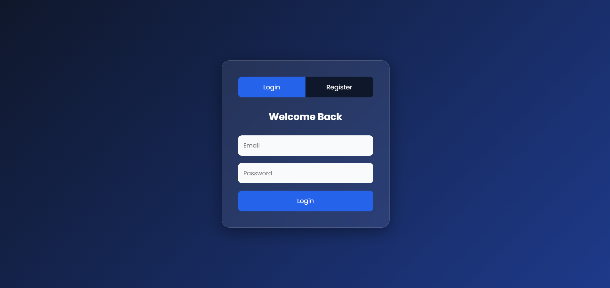
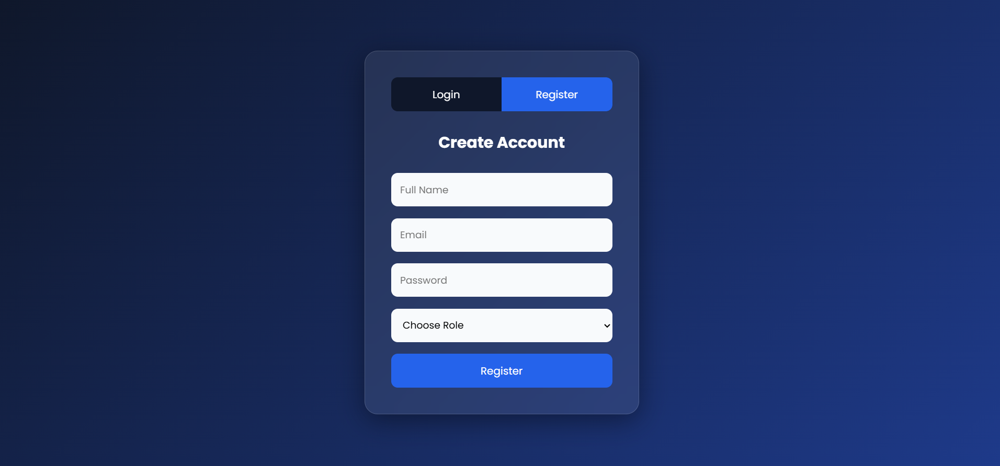
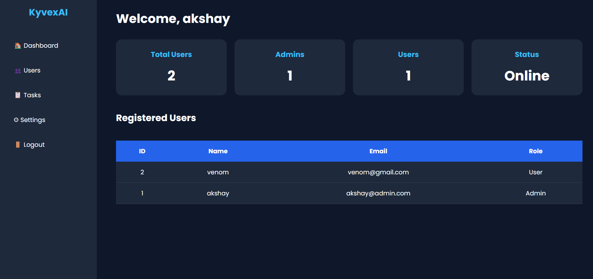
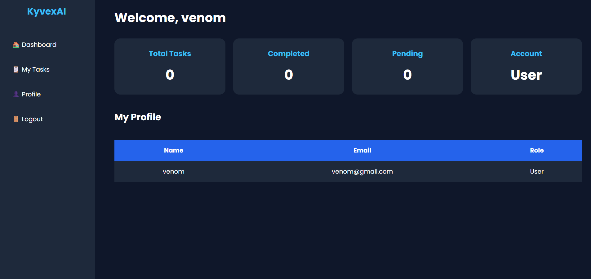

# 📝 Task Manager System

A secure and responsive Task Manager System developed using PHP, MySQL, HTML, CSS, and JavaScript. The application allows users to register, log in, and manage tasks through a simple and user-friendly interface. It implements role-based access control with separate dashboards for administrators and users.

## 🚀 Features

- User Registration & Login
- Session-Based Authentication
- Role-Based Access Control (Admin & User)
- Create, View, Update, and Delete Tasks (CRUD)
- Responsive User Interface
- Secure MySQL Database Integration
- Logout Functionality

## 🛠️ Technologies Used

- PHP
- MySQL
- HTML5
- CSS3
- JavaScript
- XAMPP (Apache & MySQL)

## 📂 Project Structure

task_manager/
│── admin_page.php
│── config.php
│── dashboard.css
│── index.php
│── login_register.php
│── logout.php
│── style.css
│── user_page.php
## ⚙️ Installation

1. Clone this repository:
  
   git clone https://github.com/Ak5h8y/task_manager.git
   
2. Move the project to the htdocs folder in XAMPP.

3. Start Apache and MySQL.

4. Create a MySQL database and update the database credentials in config.php.

5. Open your browser and visit:

  
   http://localhost/task_manager/
   
   
## 📸 Screenshots

### Login Page

### Register Page

### Admin Dashboard

### User Dashboard

## 🎯 Future Improvements

- Task Categories
- Due Dates & Reminders
- Search & Filter Tasks
- Email Notifications
- Dark Mode
- Password Reset

## 👨‍💻 Author

Akshay

GitHub: https://github.com/Ak5h8y

---

⭐ If you found this project useful, consider giving it a star!
